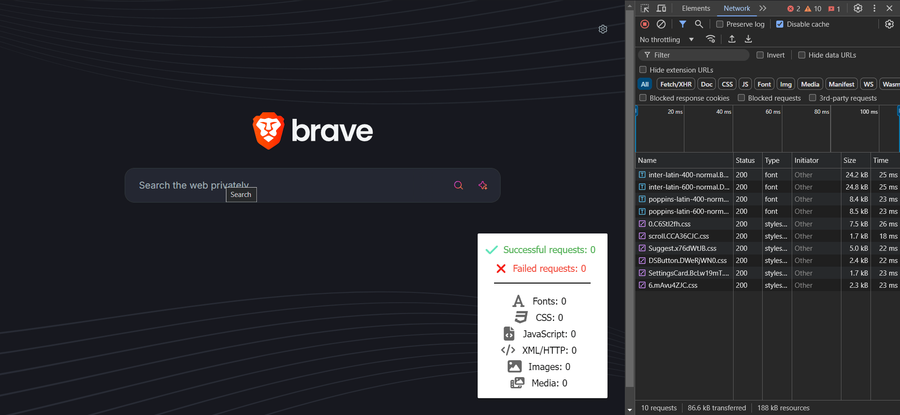

<!-- PROJECT LOGO -->
<div align="center">
  <a href="https://github.com/github_username/repo_name">
    
  </a>

<h3 align="center">Network Counter Extension</h3>

  <p align="center">
    A Chrome extension that tracks and displays the number of completed network requests made by your active tabs.
    <br />
    <br />
  </p>

</div>

<!-- ABOUT THE PROJECT -->

## Usage



### Features

- **Minimal mode**: monitors and displays the cumulative number of requests made by the active tabs.
- **Extended mode**: provides detailed tracking of both successful and failed requests, along with their resource types (fonts, CSS, scripts, XML/HTTP, images, media).
- **Toggle functionality**: Activate/deactivate the extention via a toggle switch in the popup.
- **Reset the counter**: either by clicking the reset button in the popup or pressing `Alt+Q`

<ins>Note:</ins> the extension does not count requests retrieved from the cache (these are typically shown as faded in the browser's network tab).

## Getting Started

To get a local copy up and running follow these simple steps.

### Prerequisites

Ensure you have npm and Node.js installed. If you need to install the latest version of npm globally, use the following command:

```sh
npm install -g npm
```

### Installation

To get started with the project, follow these steps:

1. Clone the repository
   ```sh
   git clone https://github.com/Erhan1706/network-counter-extension.git
   ```
2. Navigate to the project directory:
   ```sh
   cd network-counter-extension
   ```
3. Install dependencies
   ```sh
   npm install
   ```
4. Compile and build the project
   ```sh
   npm run build
   ```
5. Load extension on your browser

- Open your browser and navigate to your extension tab.
- Enable Developer mode by toggling the switch at the top-right corner.
- Click on Load unpacked and select the dist folder from the cloned repository.

## Future improvements

- Track the time taken for each type of request and provide an average or total time spent on different resource types (e.g., css, script).
- Allow the user to choose whether they want to reset the counter each time the active tab is switched.
- Add filtering functionalityshow only specific types of requests (e.g., only images, or only scripts).
